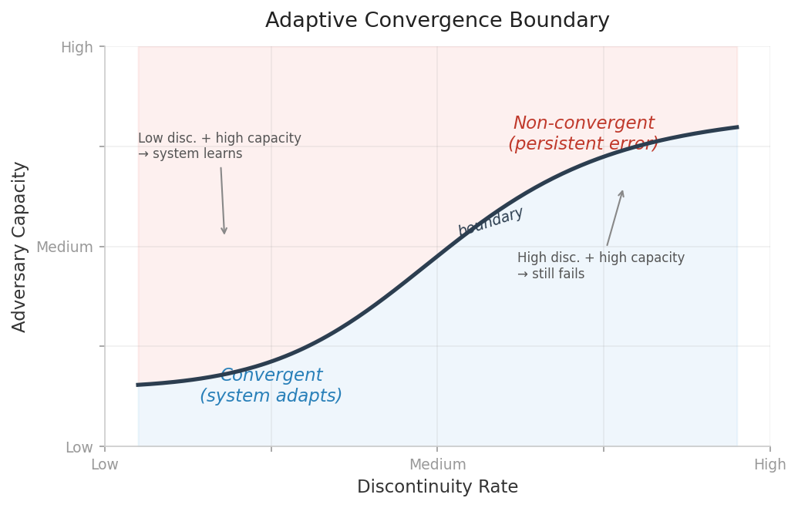

_**Note**_: For further understanding, I have created an [**article**](https://medium.com/@leenathomas01/where-adaptive-learning-stops-the-learnability-boundary-819b03ad0780) on the repo concept.

> **Renamed:** This repository was previously `ZPRE-Implementation-6G`. The code and research are unchanged — the name now reflects the core finding rather than the internal project lineage.

# Unlearnable Interference
**Adaptive Convergence Boundary Under Adversarial Signal Structures**

Adaptive interference cancellation assumes that interference is learnable. This repository maps the boundary where that assumption breaks — and shows that the failure is structural, not a matter of model capacity.

**Status: v1.0.0 — Stabilized Research Release**

---

> This repository preserves the complete experimental snapshot accompanying the research.
> The files represent the full implementation as it existed at the conclusion of the study.

---

## Core Insight

There exists a class of signals whose structure prevents convergence of adaptive filters — including nonlinear filters theoretically capable of modeling the underlying dynamics.

The failure is not due to insufficient model capacity. It is due to the **rate and structure of discontinuities** in the signal.

### Boundary Condition

> Adaptive systems fail when the rate of structural discontinuity exceeds their capacity to infer continuity.

This defines a practical limit of adaptive interference cancellation.



---

## Key Results

**Linear filters (FxLMS):**
Chaotic phase modulation collapses convergence (~3.5 dB SINR loss). The system cannot track discontinuities at τ ≈ 50 samples.

**Nonlinear filters:**
Volterra (2nd-order polynomial) partially absorbs chaotic modulation via quadratic match (~1.5 dB reduced effect). Kernel LMS overfits local chaos and fails to generalize. Online MLPs absorb simple chaos over time, but fail under hidden-state transitions and orthogonal policy jumps.

**Scaling behavior:**
Increasing model capacity from 544 to ~49k parameters yields marginal gains (~0.1–0.3 dB). The bottleneck is not capacity.

**Discontinuity dominance:**
Increasing discontinuity rate (slow → extreme) produces ~1.6 dB degradation and prevents late-stage convergence — regardless of adversary architecture.

---

## Repository Structure

```plaintext
unlearnable-interference/
├── README.md
├── requirements.txt
├── LICENSE
│
│  # Core adaptive cancellation system
├── FxLMS_UDP_Prototype.py       # FxLMS engine with safety controls (leakage, clipping, normalization)
├── ZPRE_Benchmarking.py         # Config sweeps, CSV logging, visualization
├── 6G_ISAC_Integration.py       # ISAC-style harness (KPIs, sensing, beamforming stubs)
│
│  # Adversarial anchor system
├── ChaoticAnchor.py             # Multi-layer anchor generator (L1–L4)
├── NonlinearAdversary.py        # Volterra, Kernel LMS, Online MLP adversaries
│
│  # Boundary experiments
├── AnchorBenchmark.py           # Anchor vs linear adversary (FxLMS)
├── NonlinearBenchmark.py        # Cross-matrix: anchor layers × adversary types
└── BoundaryProbe.py             # Scaled MLPs vs discontinuity rates — maps the boundary
```

---

## Quick Start

```bash
pip install -r requirements.txt

# Core system demo
python FxLMS_UDP_Prototype.py          # Adaptive cancellation baseline
python 6G_ISAC_Integration.py          # ISAC integration demo
python ZPRE_Benchmarking.py            # Config sweep + plots

# Boundary experiments
python AnchorBenchmark.py              # Anchor vs linear filter
python NonlinearBenchmark.py           # Anchor vs nonlinear adversaries
python BoundaryProbe.py                # Full boundary mapping
```

---

## How It Works

### The Adaptive Canceller

`FxLMS_UDP_Prototype.py` implements Filtered-x LMS with three operational modes (efficiency / balanced / enhance), NLMS normalization, leakage-based weight decay, and step clipping. An auto-escalation heuristic monitors residual variance and switches to aggressive mode when it detects convergence degradation.

### The Adversarial Anchor

`ChaoticAnchor.py` generates signals with four independently toggleable defense layers:

| Layer | Mechanism | What it disrupts |
|-------|-----------|------------------|
| L1 — Structural | Logistic map phase modulation | Linear correlation tracking |
| L2 — Dynamic | Feedback-controlled chaos (adaptive τ/θ) | Steady-state convergence |
| L3 — Hidden State | Private-key basis transitions | System identification |
| L4 — Epistemic | Orthogonal policy jumps (TRNG-style) | Statistical inference |

### The Nonlinear Adversaries

`NonlinearAdversary.py` provides three filters designed to test whether nonlinear capacity can overcome the anchor:

| Adversary | Capacity | Why it matters |
|-----------|----------|----------------|
| Volterra (2nd order) | Polynomial — exact match for logistic map | Can it learn the chaos generator directly? |
| Kernel LMS (RBF) | Universal approximator (infinite-dim) | Can kernel methods generalize across discontinuities? |
| Online MLP (backprop) | Universal approximator (neural) | Can gradient-based learning close the gap? |

### The Boundary Experiments

`BoundaryProbe.py` is the decisive experiment. It varies two axes independently — adversary capacity (depth, width, memory) and discontinuity rate (slow → extreme) — to map where adaptive learning fails. The result: **discontinuity rate dominates capacity scaling**.

---

## ISAC Integration

`6G_ISAC_Integration.py` provides a harness for evaluating the canceller in an Integrated Sensing and Communication (ISAC) context, with KPIs inspired by emerging 6G discussions (SINR gain, energy preservation, control latency, sensing accuracy, multi-node coherence). Beamforming and photonic acceleration interfaces are stubbed for future hardware integration.

---

## Extension Points

**Adversary scaling:**
LSTM/GRU adversaries (recurrent memory across discontinuities), transformer-based sequence prediction, ensemble methods.

**Boundary refinement:**
Finer discontinuity sweeps (interval 150–300, probability 0.03–0.07), longer runs for late-convergence analysis, theoretical lower bounds.

**Hardware integration:**
Replace `BeamformerStub` with THz/mmWave phase-array control, route canceller through photonic accelerator API, replace `SensingModule` with range-Doppler pipelines.

---

## Related Work

**For a complete catalog of related research:**
[Research Index](https://github.com/leenathomas01/research-index)

**Thematically related:**
- [Zero Water AI Data Center](https://github.com/leenathomas01/zero-water-ai-dc) — Infrastructure optimization
- [Designing for Failure](https://github.com/leenathomas01/designing-for-failure) — Structural patterns for catastrophic-state systems

---

## License

Apache 2.0 — see [LICENSE](LICENSE) for details.
